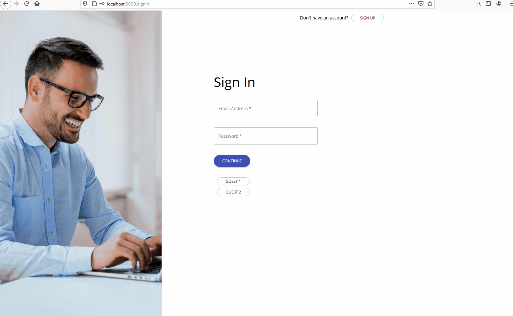
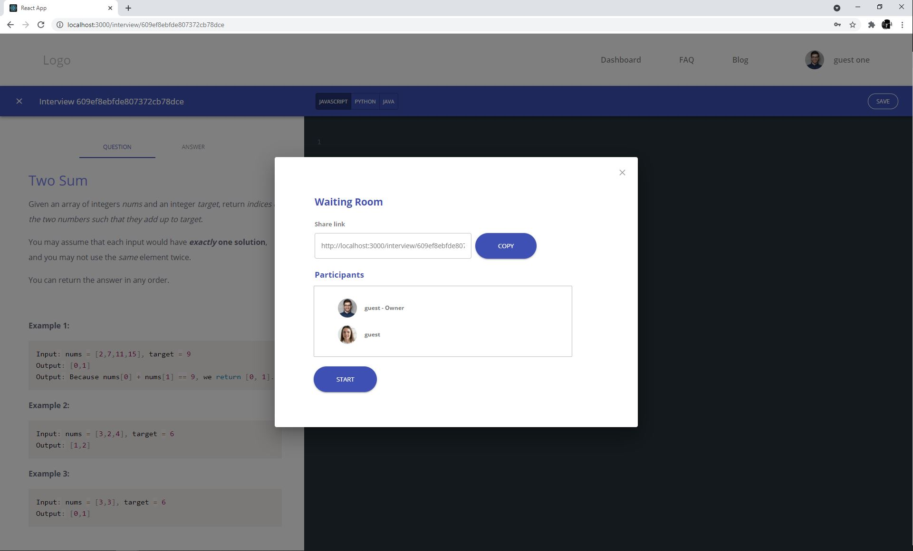
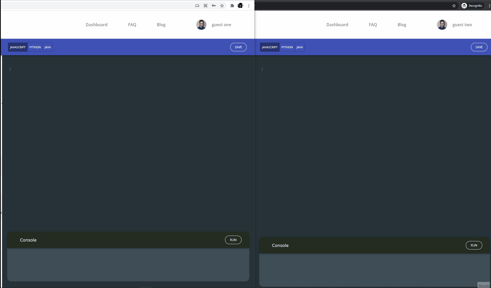
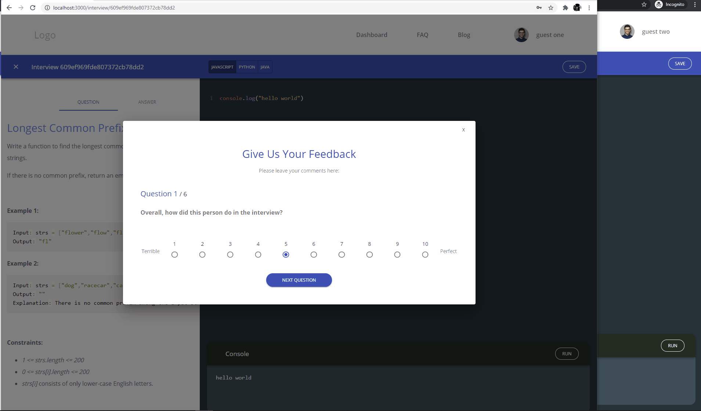

# PearInterview

PearInterview is a web application designed to assist developers to groom their technical interview skills using a peer programing approach. The application provides a interactive code editor in which users can work collaboratively to solve an interview question. At the same time, a random question is displayed depending on the selected dificulty. Once the users have finished the interview, both users can rate their peers providing valuable feedback.

## Table of Contents

- [General Info](#general-info)
- [Contributors](#contributors)
- [Technologies](#technologies)
- [Features](#features)
- [Usage](#usage)
- [Acknowledgements](#acknowledgements)
- [Screenshoots](#screenshoots)

---

## General Information

This application was made as part of the co-hort program with Hatchways.

## Contributors

- [Joel MacKenzie](https://github.com/joelmackenz)
- [Carlos Neisa](https://github.com/AndresNeisa)
- [Hassan Farahani](https://github.com/hassanfarahani)

## Technologies

- React.js
- Mongodb
- Node.js / Express.js
- Socket.io
- Puppeteer
- Material-UI

## Features

- User login/sign up authentication using JWT.
- Real-time code editor to facilitate peer programing.
- JavaScript, Python, and Java support.
- More than 200 interview questions.
- Feedback form and visualizer.

## Usage

- Sign on to the platform and create an account
- sign up for upcoming mock interview events (you can create an interview and share the interview room link with the person you'd like to have interview with)
- When the interview starts, a question based on the difficulty level you choose for the interview will be shown to all participants in the room (Maximun two persons per room). There is also a code editor and compiler for three languages (JavaScript, Java & Python) that you can use to write your code
- Feedback portal- after the session (interview) is complete, a short survey (save button) will come up to rate the person you interviewed that will be shared with the other person
- You can submit feedback (survey form) of your partner & recieves feedback from your partner
- You can submit a review of your partner’s feedback and experience (Reviews system- provide a review of your partner’s quality of feedback )

## Acknowledgements

Many thanks to Hatchway's team for their help during this co-hort program.

## Screenshoots

### User login/sign up

### Waiting room

### Code editor

### Feedback

